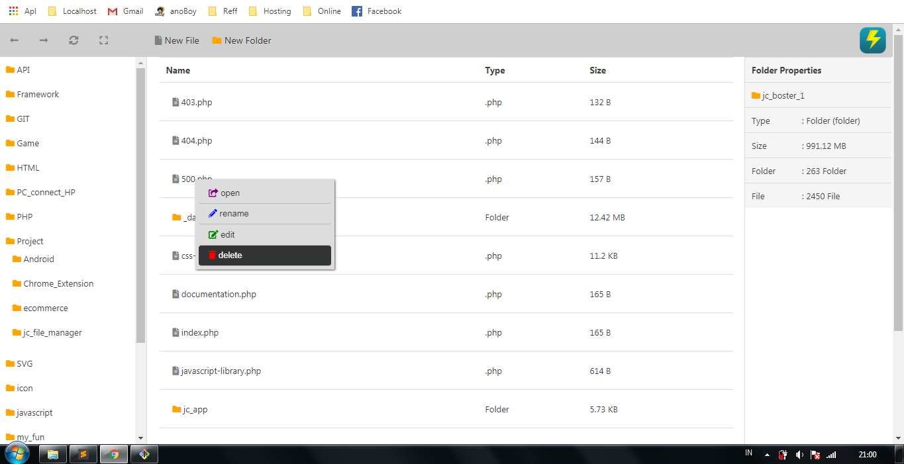

	

# jc_file_manager
Simple Project File Manager

# Use
Load Index File

# Load Path Directory
setting load path directory on config.json

# Extensions File
add Manual extension file in config.json if retun extension is null

